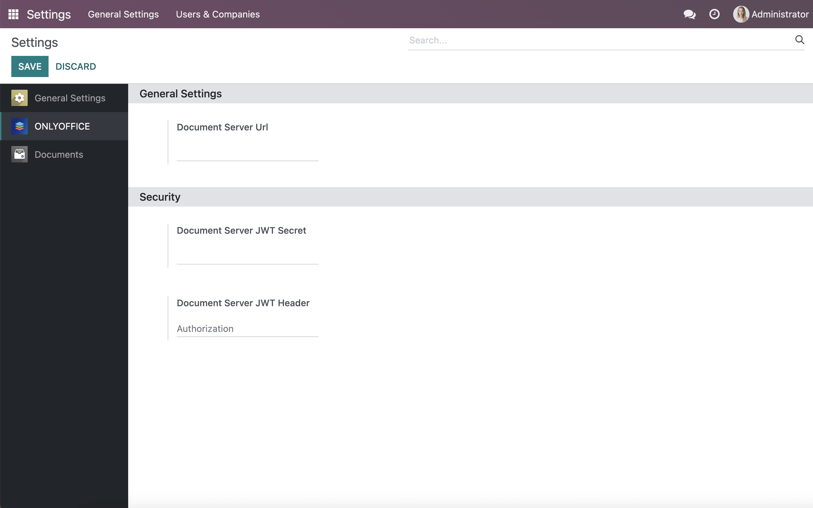

Prerequisites
=============

To be able to work with office files within Odoo Enterprise, you will need an instance of euro_office Docs. You can install the `self-hosted version`_ of the editors or opt for `euro_office Docs`_ which doesn't require downloading and installation.

euro_office app configuration
============================

**Please note**: All the settings are configured from the `main euro_office app for Odoo`_ which is installed automatically when you install euro_office app for Odoo Enterprise.
To adjust the main app settings within your Odoo, go to *Home menu -> Settings -> euro_office*.

In the **Document Server Url**, specify the URL of the installed euro_office Docs or the address of euro_office Docs Cloud.

**Document Server JWT Secret**: JWT is enabled by default and the secret key is generated automatically to restrict the access to euro_office Docs. if you want to specify your own secret key in this field, also specify the same secret key in the euro_office Docs `config file`_ to enable the validation.

**Document Server JWT Header**: Standard JWT header used in euro_office is Authorization. In case this header is in conflict with your setup, you can change the header to the custom one.

In case your network configuration doesn't allow requests between the servers via public addresses, specify the euro_office Docs address for internal requests from the Odoo server and vice versa.

If you would like the editors to open in the same tab instead of a new one, check the corresponding setting "Open file in the same tab".

Contact us
==========

If you have any questions or suggestions regarding the euro_office app for Odoo, please let us know at https://forum.euro_office.com

.. _self-hosted version: https://www.euro_office.com/download-docs.aspx
.. _euro_office Docs: https://www.euro_office.com/docs-registration.aspx
.. _config file: https://api.euro_office.com/docs/docs-api/additional-api/signature/
.. _main euro_office app for Odoo: https://apps.odoo.com/apps/modules/16.0/euro_office_odoo/
